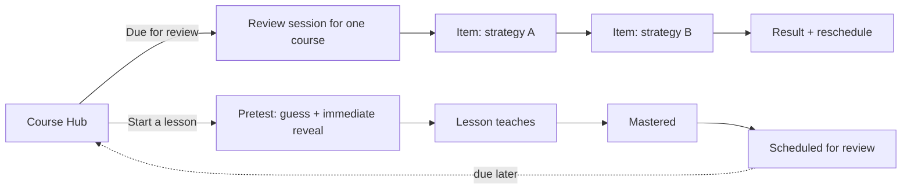

# Review & Retention layer: Product Requirements

> What the learner experiences once the app stops teaching a concept only once and
> starts bringing it back. This PRD covers the user-facing contract; the mechanism
> lives in [`spec-review-retention.md`](spec-review-retention.md) and the choices in
> [`alternatives.md` → D-RR](alternatives.md#d-rr-review-and-retention-layer).
>
> **Authority:** frozen initial plan, written before implementation. For current
> truth read `AGENTS.md` and the decision log; where a later decision conflicts
> with this doc, the decision wins.

## 1. Overview

- **Feature:** a Review & Retention layer over the existing lessons: spaced,
  interleaved retrieval of mastered concepts, a durable per-concept retention
  state, and a one-question pretest opening each lesson.
- **Persona:** the same learner the app already serves, a student with no prior
  background who has finished one or more lessons and wants what they learned to
  stick, not fade by next week.
- **Platform:** React + Vite + Firebase, no new dependencies (D-RR2, D-RR4).

## 2. Concept and audience

- **Pitch:** the app remembers what you are about to forget and asks for it at the
  right moment.
- **Core loop:** master a concept, then recall it a day later, then a few days
  later, then weeks later, mixed with sibling concepts, with feedback each time.
- **Status-quo problem:** today a passed lesson is marked mastered forever and
  never returns, so the win is real in the moment and gone by the test.
- **Payoff:** the learner feels concepts get easier to recall over time and trusts
  that "mastered" means it will still be there later.
- **Differentiator:** the schedule is automatic and built from the same
  interactive content, not a separate flashcard deck, and it is honest that a
  smooth in-session streak is not the same as durable learning.

## 3. UX walkthrough (a session)

Maya finished Overcounting yesterday.

1. She opens the app to keep her streak. The Course Hub shows a "Due for review"
   card on Counting Strategies: "2 concepts due."
2. She taps it. A short session starts: one problem from Multiplication, then one
   from Overcounting (mixed, not grouped), one at a time.
3. She answers the first. It is correct, she gets a brief "Correct" and the rule
   restated. The second she gets wrong; the feedback names the fix, no answer dump.
4. The session ends: "Recalled 1 of 2. Multiplication moves further out;
   Overcounting comes back in a few days." Her streak ticks.
5. Later she starts a brand-new lesson, Casework. Before anything is taught it asks
   her to predict an answer. She guesses; the correct answer is revealed at once,
   then the lesson teaches why. The guess being wrong did not block her.

## 4. UI direction

Reuse the existing visual system and components (course-test input, feedback
banner, continue button); no new design language. The due card is a quiet,
specific affordance, not a banner that sells. Copy is plain and in the app's
voice: a label labels, feedback states the fix. Light and dark mode, mobile
responsive, visible keyboard focus, as the rest of the app. Not in this phase: a
retention analytics dashboard, animations beyond what the existing flows use.

## 5. Acceptance criteria

Shipped when all of the following are observable in the deployed app.

**Review scheduling and surface**
1. After a learner masters a lesson, that concept later appears in a "Due for
   review" entry, first about a day on, then at growing gaps.
2. The Course Hub shows how many concepts are due per course and a way into the
   review session; it never shows one merged cross-course pile.
3. A review session asks due concepts one at a time, mixed in order (not grouped by
   strategy), each answered before any feedback, with feedback shown after each.
4. Finishing a session shows what was recalled and that recalled concepts now
   return later while missed ones return sooner.

**Durable mastery**
5. A concept the learner keeps getting right in review visibly comes due less
   often; one they miss comes due sooner.
6. Falling behind on a concept never re-locks a lesson the learner already
   unlocked.

**Pretest**
7. Every lesson opens with one prediction, and the correct answer is shown
   immediately after the learner submits or skips, before the teaching starts.

**Scope / negative criteria**
8. No single review session mixes two different courses or subjects.
9. No review item shows its answer before the learner attempts it.
10. With the backend off (offline or test), the due queue and review still work
    from local state, and no made-up items appear.

→ Spec: [`spec-review-retention.md`](spec-review-retention.md). Decisions:
D-RR1, D-RR5, D-RR6, D-RR7, D-RR8, D-RR10.

## 6. Cross-cutting edge cases

| # | Edge case | Resolution owned by |
| --- | --- | --- |
| 1 | A concept is reinforced by the course test and also due in the daily queue the same day | Spec §5 de-duplication; AC 12 in spec |
| 2 | Learner has nothing due | Course Hub shows no due card for that course (AC 2) |
| 3 | Concept has only one authored item | Item repeats but still a valid recall (spec §9); authoring target ≥ 3 (spec §10) |
| 4 | Learner repeatedly fails a concept | Demote + daily cap keep volume sane; relearn route deferred (spec §9, §13) |
| 5 | Firebase / AI off | Local schedule, honest degradation (AC 10; spec §7) |
| 6 | Pretest guessed wrong or skipped | Answer revealed regardless; not gated (AC 7; D-RR8) |
| 7 | Lesson mastered before this layer existed | Backfill a retention record at first app open after release (spec §7 offline pattern applies) |

## 7. Out of scope (this phase)

- AI-generated review items (D-RR4).
- More than one concept per lesson (D-RR9).
- Relearn-in-the-lesson routing for chronic lapses.
- Personalized intervals and a learner-facing retention dashboard.

## 8. Companion documents

| Doc | Owns |
| --- | --- |
| [`spec-review-retention.md`](spec-review-retention.md) | Mechanism: ladder, queue assembly, data model, algorithms, ACs |
| [`alternatives.md`](alternatives.md) | The D-RR decision cluster (Chose / Considered / Gaps) |

---

Created with the `iris-plan` skill by Iris Cai · maintained with `iris-log`.
