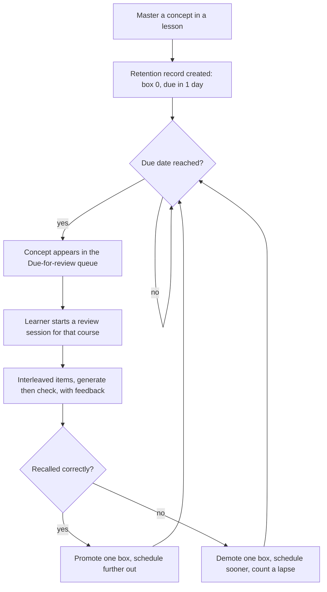
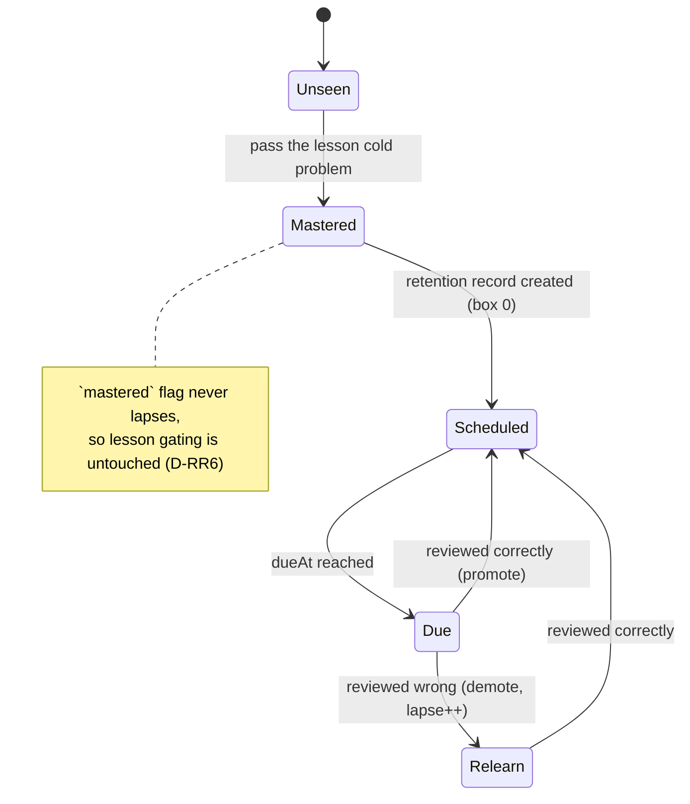
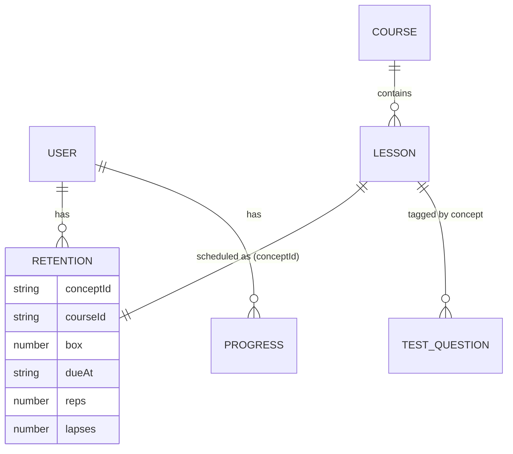

# Spec: Review & Retention layer

> A spaced, interleaved retrieval layer that sits on top of the existing lessons.
> Once a learner masters a concept, the app schedules it for retrieval at growing
> intervals, mixes due concepts within a course into short review sessions, tracks
> a durable per-concept retention strength separate from the one-shot `mastered`
> flag, and opens each lesson with a quick prediction. It lives at a new
> `/review` route plus a "Due for review" entry on the Course Hub. Companions:
> [`prd-review-retention.md`](prd-review-retention.md), decision cluster
> [D-RR](alternatives.md#d-rr-review-and-retention-layer). Status: design locked,
> unbuilt.
>
> **Authority:** frozen initial design, written before implementation. For current
> truth read `AGENTS.md` and the decision log; where a later decision conflicts
> with this doc, the decision wins.

## 1. The problem this fills

The app teaches each concept well once, then never brings it back. Concretely:

- **Mastery is a single performance reading.** `mastered` is set the first time a
  learner passes a cold problem and never lapses. That is retrieval strength
  measured in the moment, frozen as if it were durable learning. This is the
  learning-versus-performance trap: in-the-moment accuracy overstates what will
  survive a week (Soderstrom & Bjork 2015).
- **No spacing.** The only re-exposure is one course-level retest two days after
  the course test. There is no per-concept schedule, no growing intervals, no
  notion of a concept being "due". Spacing and retrieval practice are the two
  highest-utility techniques in the literature (Dunlosky et al. 2013) and the app
  uses neither across sessions.
- **No interleaving.** Lessons are blocked by topic. The whole point of a
  "counting strategies" course is choosing the right strategy, which only mixed
  practice trains (Rohrer & Taylor 2007).
- **No pretest.** Lessons open by building, not by a guess-then-reveal, so they
  skip a cheap encoding boost (the prequestion effect).

`BrilliantPRD.md` explicitly deferred this ("no learning-science layers (spaced
repetition, interleaving, etc.) until this lesson works standalone, those are
later project phases"). All 18 lessons across three courses are now built, so this
is that phase.

## 2. Goals and non-goals

**Goals**

- Schedule every mastered concept for spaced retrieval and surface what is due.
- Make review sessions interleave strategies within a course.
- Track a per-concept retention strength that decays into "due" and recovers on a
  successful recall, without touching the existing `mastered` gating.
- Open each lesson with a one-question pretest whose answer is revealed at once.
- Degrade honestly when Firebase or AI is off (local schedule still works).

**Non-goals**

- No SM-2 / FSRS ease-factor engine (D-RR2).
- No AI-generated review items in this phase (D-RR4).
- No cross-domain mixing in a single session (D-RR7).
- No replacement of the existing course test (D-RR11).
- No change to how lessons gate on `mastered` (D-RR6).

## 3. Grounding (research + product scan)

**Why it works.**

| Lever | Finding | Source |
| --- | --- | --- |
| Retrieval practice | Retrieving strengthens memory more than restudy; testing wins at a delay even without feedback. Rated HIGH utility. | Roediger & Karpicke 2006; Dunlosky et al. 2013 |
| Spacing | Spacing beats massing; optimal gap is roughly 10 to 20% of the retention interval, and overshooting costs less than undershooting. Rated HIGH. | Cepeda et al. 2008; Pashler et al. 2007 |
| Schedule shape | Expanding vs equal intervals barely differs; what matters is real spacing and a delayed (effortful) first retrieval. Absolute spacing alone gave about a 200% retention gain. | Karpicke & Roediger 2007; Karpicke & Bauernschmidt 2011 |
| Interleaving | Mixing problem types trains discrimination (which strategy fits), within one domain; about 72% vs 38% on a delayed test. | Rohrer & Taylor 2007; Rohrer et al. 2014 |
| Pretesting | A guess before instruction improves retention of the revealed answer, even when the guess is wrong, if the answer follows immediately. | Kornell, Hays & Bjork 2009; Pashler et al. 2007 |
| Feedback | Quizzing with feedback is rated STRONG; quizzing without feedback backfires. | Pashler et al. 2007 |
| Read dashboards right | Streaks, completion, and immediate accuracy capture performance and overstate durable learning; infer learning from delayed retention. | Soderstrom & Bjork 2015 |

**Caveats the design respects.** Difficulties must be surmountable, so the failure
rate is kept moderate (a miss demotes rather than punishes). Interleaving stays
within a domain. The pretest's reveal is mandatory (the active ingredient); a
review never reveals before the learner generates an answer (the lethal mutation
to avoid). Spacing benefits show at a delay, so success is judged on later recall,
not in-session speed.

**Product scan.**

| App | Spacing | Interleaving | Pretest | Gap we fill |
| --- | --- | --- | --- | --- |
| Brilliant | Light; mostly linear courses | Within-lesson only | No | Per-concept schedule + due queue |
| Duolingo | Strong (per-skill decay, "cracked" skills) | Yes, within a language | No | Same idea, applied to STEM strategies |
| Anki | Strong (SM-2) | Deck-dependent | No | We keep the schedule simple and tie it to interactive lessons, not flashcards |
| Quizlet | Optional spaced "Learn" mode | Limited | No | Schedule is automatic, not opt-in |
| Khan Academy | Mastery decay + review | Some | No | Tighter strategy-discrimination focus |

Our wedge: a lightweight, automatic per-concept schedule that feeds short
interleaved retrieval sessions built from the interactive content the app already
has, with a durable-mastery model that is honest about learning vs performance.

## 4. The mechanic

The core loop:



Sub-choices, each with its reason; full rationale in §12.

- **Entry to the schedule:** mastering a lesson creates its retention record at box
  0, due one day later (D-RR3). The first gap is deliberately at least a day so the
  first recall is effortful.
- **Unit of review:** one concept equals one lesson for this phase (D-RR9). Items
  for a concept are the course-test questions tagged to that lesson (D-RR4).
- **Session shape:** a session is scoped to one course and interleaves its due
  concepts (D-RR5, D-RR7). One item per due concept per session, mixed order.
- **Grading:** each item is generate-then-check with feedback (D-RR10). Correct
  promotes, wrong demotes (§5).
- **Pretest:** independent of the schedule, each lesson opens with one prediction
  and an immediate reveal (D-RR8).

## 5. Scoring, rules, algorithms

**Box ladder.** Intervals in days, indexed by box:

```ts
export const BOX_INTERVALS_DAYS = [1, 3, 7, 21, 60] as const
export const FIRST_BOX = 0
export const LAST_BOX = BOX_INTERVALS_DAYS.length - 1
```

**Schedule transitions** (pure, unit-tested):

```ts
// Entering the schedule when a concept is first mastered.
function enterSchedule(now: Date): RetentionState {
  return { box: 0, dueAt: addDays(now, BOX_INTERVALS_DAYS[0]), reps: 0, lapses: 0,
           introducedAt: iso(now), lastReviewedAt: null }
}

// A graded review outcome.
function applyReview(s: RetentionState, correct: boolean, now: Date): RetentionState {
  const box = correct ? Math.min(s.box + 1, LAST_BOX) : Math.max(s.box - 1, FIRST_BOX)
  return {
    ...s,
    box,
    dueAt: addDays(now, BOX_INTERVALS_DAYS[box]),
    reps: correct ? s.reps + 1 : s.reps,
    lapses: correct ? s.lapses : s.lapses + 1,
    lastReviewedAt: iso(now),
  }
}

function isDue(s: RetentionState, now: Date): boolean {
  return new Date(s.dueAt).getTime() <= now.getTime()
}
```

**Worked examples** (assume review on the day it falls due):

| Event | box before | correct? | box after | next due |
| --- | --- | --- | --- | --- |
| Master lesson-1 | (none) | n/a | 0 | +1 day |
| Review day 1 | 0 | yes | 1 | +3 days |
| Review day 4 | 1 | yes | 2 | +7 days |
| Review day 11 | 2 | no | 1 | +3 days |
| Review day 14 | 1 | yes | 2 | +7 days |

**Daily queue assembly** (pure, unit-tested):

```ts
// Group due concepts by course, interleave within each course, cap per day.
function buildDueQueue(records: RetentionRecord[], now: Date, capPerCourse = 8): DueGroup[] {
  const due = records.filter((r) => isDue(r.state, now))
  const byCourse = groupBy(due, (r) => r.courseId)
  return Object.entries(byCourse).map(([courseId, rs]) => ({
    courseId,
    // Interleave: oldest-due first, then round-robin so adjacent items differ in
    // strategy as much as possible. Cap so a session stays short.
    concepts: interleaveByStrategy(rs).slice(0, capPerCourse),
  }))
}
```

**Item selection per concept.** Pick one un-recently-used question tagged to the
concept; if all have been used, pick the least-recently-used. Item pool is the
course-test bank filtered by `concept` (D-RR4).

**De-duplication with the course test (D-RR11).** When a concept's
`lastReviewedAt` (or the course test's `reinforcedAt`) is the current day, it is
not surfaced again in the daily queue that day.

## 6. The key screens

1. **Course Hub "Due for review" card.** Shows a count of due concepts and a
   primary action into the review session. The non-negotiable element: it shows
   the count per course, never one merged cross-domain pile (D-RR7).
2. **Review session (`/review/:courseId`).** One interleaved item at a time,
   generate-then-check, feedback after each, a short result at the end (recalled
   N of M, what got promoted, what comes back sooner). Reuses `GateInput`,
   `ChoiceInput`, `FeedbackBanner`, `ContinueButton` from the course test.
3. **Lesson pretest opener.** Before step 1, one prediction with an immediate
   reveal, then "Now let's see why." The non-negotiable element: the answer
   reveal is always shown, regardless of the guess (D-RR8, D-RR10).

State for a concept over its life:



## 7. Data model

New per-user subcollection (D-RR9):

```
users/{uid}/retention/{conceptId}
  conceptId: string        // = lesson id for this phase, e.g. "lesson-3"
  courseId: string         // for within-course interleaving + grouping
  box: number              // 0..LAST_BOX
  dueAt: string            // ISO datetime the concept next becomes due
  lastReviewedAt: string | null
  introducedAt: string     // ISO datetime it entered the schedule
  reps: number             // successful reviews
  lapses: number           // demotions
```

Content change: tag each review item with its concept so a concept can pull its
pool (D-RR4):

```ts
// added to TestQuestion in courseTests.ts
type TestQuestion = { /* …existing… */ concept: string /* = lesson id */ }
```

Entities and relations:



**Security rules** (extend `firestore.rules`, same owner-only pattern as
`progress`):

```
match /users/{userId}/retention/{conceptId} {
  allow read, write: if request.auth != null && request.auth.uid == userId;
}
```

**Scaling.** The due queue reads the whole `retention` subcollection per user.
With ≤ 18 concepts this is one cheap collection read; no composite index needed.
If concept count grows past a few hundred, add a `dueAt`-ordered query with a
limit. Stated honestly so the dispatcher knows the boundary.

**Offline / Firebase-off.** Mirror the existing `useLessonProgress` pattern: a
`localStorage` retention map keyed `brilliantclone-retention-{conceptId}`, read
and written the same way progress is, so the schedule works in e2e and offline.

## 8. UI surfaces

| Surface | Route / location | Owns |
| --- | --- | --- |
| Due-for-review card | Course Hub (`CourseHub.tsx`) | per-course due count + entry |
| Review session | new `/review/:courseId` (`ReviewSessionPage.tsx`) | interleaved retrieval + grading + result |
| Pretest opener | first step of each lesson (`LessonRunner`) | one prediction + immediate reveal |
| Retention hook | `useRetention.ts` | read/write records, build due queue |
| Schedule lib | `lib/retention.ts` | pure ladder + queue helpers (§5) |

The streak already nudges daily return; the due card gives that return a concrete,
high-value action (motivation follows achievement: a small daily win).

## 9. Cold-start and the real risk

The biggest risk is a thin item bank (6 to 7 questions per course). On day one a
concept has one or two items, so reviews repeat fast and feel rote.

Layered mitigations:

- Phase 1 ships with the existing bank plus a target of at least 3 items per
  concept (authoring, §10).
- Items are picked least-recently-used so repeats are spread out.
- A concept with only one item still earns a valid retrieval (one effortful recall
  beats none); variety improves as the bank grows.
- AI-generated items (deferred, §13) are the long-term answer to variety.

Second risk: a learner who lapses repeatedly gets stuck near box 0 and sees the
same concept daily. Mitigation: the daily cap and the per-day de-duplication keep
volume sane; a future "relearn in the lesson" link (deferred) routes chronic
lapses back to instruction rather than more quizzing.

## 10. Content and ops

- **Authoring contract:** each concept (lesson) needs at least 3 review items in
  `courseTests.ts`, tagged with `concept: <lessonId>`, each with a one-line
  `explain` shown as feedback. Items must be answerable from the concept alone.
- **Pretest authoring:** each lesson gets one `pretest` opener: a single
  prediction (numeric or choice) with the correct answer and a one-line reveal.
- **Quality bar:** an item is generate-then-check (no answer visible first), the
  feedback states the rule, and the prompt is one short scenario line, matching
  `docs/PREFERENCES.md` voice.

## 11. Acceptance criteria

Shipped when all of the following are observable in the running app.

**Scheduling**
1. Mastering a lesson creates a retention record at box 0 due one day later.
2. A correct review promotes the concept one box and schedules it by
   `BOX_INTERVALS_DAYS[box]`; a wrong review demotes one box, increments `lapses`,
   and schedules it sooner.
3. `lib/retention.ts` helpers (`enterSchedule`, `applyReview`, `isDue`,
   `buildDueQueue`) are pure and covered by unit tests, including the §5 worked
   examples.

**Review surface**
4. The Course Hub shows a per-course due count and an entry to the session; it
   never merges courses into one pile.
5. A review session presents due concepts for one course, interleaved (adjacent
   items are different strategies where the due set allows), one at a time,
   generate-then-check, with feedback after each.
6. Finishing a session updates each reviewed concept's record and shows a result
   (recalled N of M, next-due changes).

**Mastery vs retention**
7. Lesson unlock gating is unchanged: it still reads `mastered`, and a lapsed
   concept never re-locks a downstream lesson.

**Pretest**
8. Each lesson opens with one prediction; submitting any answer (right, wrong, or
   skipped) reveals the correct answer before instruction begins.

**Honesty / degradation**
9. With Firebase off, the schedule and queue work from `localStorage`; no item
   reveals its answer before an attempt; no fabricated items appear.

**Scope / negative criteria**
10. No review session mixes two courses/domains.
11. No SM-2 / FSRS ease factors exist in the schedule code.
12. The existing course-test `primed → retest → reinforced` loop still works, and a
    concept reinforced by the course test today is not also surfaced in the daily
    queue that day.

Emulator rules tests: a user can read/write only their own `retention/*`
documents; another uid is denied.

## 12. Decisions and alternatives

The full cluster lives in
[`alternatives.md` → D-RR](alternatives.md#d-rr-review-and-retention-layer). Summary:

- **D-RR1** scope: all four levers. **D-RR2** model: interval ladder, not SM-2.
  **D-RR3** constants: 1/3/7/21/60 days, first gap ≥ 1 day.
- **D-RR4** items: reuse + expand the course-test bank. **D-RR5** surface:
  cross-course daily queue. **D-RR6** semantics: retention separate from
  `mastered`. **D-RR7** interleave within a domain only.
- **D-RR8** pretest: guess then immediate reveal. **D-RR9** data: `retention`
  subcollection. **D-RR10** guardrails: generate-then-check, always feedback.
  **D-RR11** keep the course test as the capstone. **D-RR12** doc filenames.

## 13. Out of scope (now), tracked

- AI-generated review items via a Cloud Function (phase 2; D-RR4).
- Sub-lesson concepts (more than one concept per lesson) (phase 2; D-RR9).
- "Relearn in the lesson" route for chronic lapses (phase 2; §9).
- Personalized intervals / difficulty per item (phase 3; D-RR2).
- Retention analytics dashboard for the learner (phase 3).

## 14. Product phasing (roadmap)

- **Phase 1 (this spec):** ladder schedule, `retention` records, daily due queue,
  interleaved sessions from the existing bank (expanded to ≥ 3 items per concept),
  pretest openers, honest offline degradation.
- **Phase 2:** AI-generated items, sub-lesson concepts, relearn-in-lesson routing.
- **Phase 3:** personalized intervals, learner-facing retention analytics.

---

<sub>Created with the `iris-plan` skill by Iris Cai.</sub>
